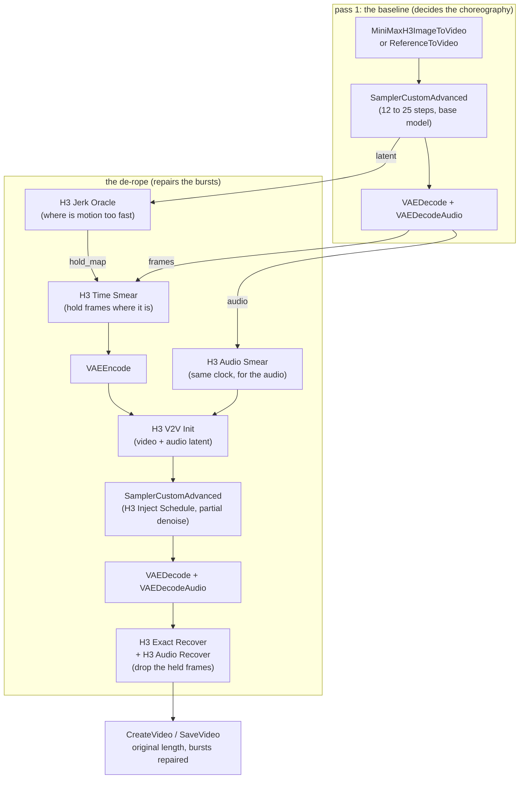
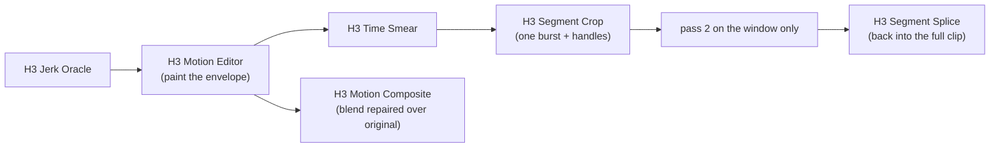

# Start here

Thirty-odd files in this folder is a lot of doors. This page says which one to
open. Every graph comes in two flavours: `name.json` loads in the ComfyUI
editor, `name_api.json` is the same graph in API form for scripts and
coding agents.

The folder has three tiers:

| tier | where | what it means |
|---|---|---|
| **start here** and **specialised** | this folder | measured, maintained, dials documented in [`../TUNING.md`](../TUNING.md) |
| **experimental** | [`experimental/`](experimental/), [`wan22/`](wan22/) | runs, interesting, one machine, interface may change; [`../ALPHA.md`](../ALPHA.md) says how alpha each one is |
| **archived** | [`archive/`](archive/) | superseded recipes, kept so the numbers in old write-ups still resolve; do not start from these |

## Which graph

| you want | graph | needs |
|---|---|---|
| **the normal starting point** | [`motion_pipeline_ref2va_audioinit.json`](motion_pipeline_ref2va_audioinit.json) | Ref2VA checkpoint, a reference image, the lightx2v turbo LoRA. 12 steps on the base model for pass 1, turbo at 6 steps for the de-rope, audio seeded. 192 frames at 1 MP in ~12 min on our card |
| best quality, time is no object | [`motion_pipeline.json`](motion_pipeline.json) | FL2VA checkpoint, first-frame image. 25 steps both passes, no turbo, the audio fixes included. The starting-point graph run this way measured 36 min against 12 |
| a 16 to 24 GB card | [`motion_pipeline_lowvram.json`](motion_pipeline_lowvram.json) | W4A8 checkpoint, NVFP4 text encoder, ~32 GB of system RAM. Measured on fenced 16/24/32 GB budgets, see [`../LOWVRAM.md`](../LOWVRAM.md) |
| to try prompts and seeds fast | [`motion_pipeline_fast_iterate.json`](motion_pipeline_fast_iterate.json) | 0.2 MP pass 1, 0.4 MP de-rope, ~95 s. A scouting loop, not a final |

If you only read one more line: **pass 1 decides the choreography, pass 2
repairs the bursts.** Spend steps on pass 1; pass 2 is where the turbo
LoRA belongs. The base model on pass 2 is better still, if you have
forever to spend.

## The essential graph

Every motion graph in this folder is this chain with something bolted on.
Eleven nodes, two of them samplers:

Three dials do most of the work:

| dial | node | what it trades |
|---|---|---|
| `preset` / `q` / `d_max` | H3 Jerk Oracle | how much of the clip gets slowed, and by how much. `balanced` is q 0.75, d_max 4 |
| `inject` | H3 Inject Schedule | how far pass 2 is allowed to re-decide. 0.50 is sharper and tracks the source closer, 0.70 is the safer playback default. Effective pass-2 steps = total_steps x inject |
| `audio_mode` | H3 V2V Init | `0.5` seeds pass 2 with the baseline performance so dialogue survives the slow-down |

The full symptom-to-dial table is [`../TUNING.md`](../TUNING.md#symptom-to-dial).

## Specialised graphs

Each one is the essential graph plus the nodes named in the diagram.

**You know where the problem is.**
[`motion_pipeline_targeted.json`](motion_pipeline_targeted.json) replaces
the oracle's decision with typed time ranges; you pay for your spans only.

**You want to paint it instead.**
[`motion_pipeline_editor.json`](motion_pipeline_editor.json) puts a GUI on
the hold map: blocks, painting, automation.
[`motion_pipeline_editor_segment.json`](motion_pipeline_editor_segment.json)
adds a crop around one burst so a long clip pays for the window only.

**Cheap pass 1, expensive pass 2.**
[`motion_pipeline_upscale_derope.json`](motion_pipeline_upscale_derope.json)
renders the baseline at 0.4 MP and de-ropes at 1.5 MP: 89% of native
detail in 83% of the time on our measurements.

**The dilated pass does not fit the card.**
[`motion_pipeline_rolling_window.json`](motion_pipeline_rolling_window.json)
(and the `_lowvram` twin) slides a fixed-size window across the clip, so
peak memory follows the window, not the clip. Alpha: validated end to
end, waiting on field reports from real 24 to 32 GB cards.

**Two different long-video jobs, easy to confuse.** Already have one long
clip and want it repaired? That is the rolling window above: one world,
the expensive pass chunked. Want to MAKE a long clip but can only afford
short generations? That is extension: short segments generated and
de-roped one at a time, a short video+audio tail carried into the next
segment as its opening context, the overlap trimmed at assembly. The two
trade differently: the window keeps one semantic world at bounded memory;
extension accepts some drift between separately generated worlds in
exchange for bounded compute. An extension start-here graph is planned;
until it lands, the pieces are `MiniMaxH3AddGuide` (core) for the carried
tail, with the grid rules in [`../TUNING.md`](../TUNING.md#chained-clips-and-the-audio-clock).

**No audio init.**
[`motion_pipeline_ref2va.json`](motion_pipeline_ref2va.json) is the
starting-point graph without `H3 Audio Smear`; use it to hear what the
audio init changes, otherwise prefer the `_audioinit` twin.

**Contact sheets** are a different product: one call, several consistent
views of a character.
[`contact_sheet.json`](contact_sheet.json) (from a reference image) and
[`contact_sheet_t2i.json`](contact_sheet_t2i.json) (from text).

## Experimental

In [`experimental/`](experimental/):

- `motion_pipeline_adapter.json`: the motion adapter pilot, a LoRA trained
  on the de-rope task, on the pass-2 model only. Known costs in the README
  section [The motion adapter (pilot)](../README.md#the-motion-adapter-pilot).
- `motion_window_pinned_adapter_api.json`: a clip you already have,
  regenerated at denoise 0.70 with first and last frames pinned, adapter on.

In [`wan22/`](wan22/): the de-rope on a model that is not H3. One cell
measured so far; the dials are not tuned there.

## Two recipes, and why both exist

The graphs in this folder were minted in two waves, and the settings
differ. Neither is wrong; they are different budgets.

| | the August 8 recipe | the August 19 recipe |
|---|---|---|
| graphs | `motion_pipeline`, `_targeted`, `_editor`, `_editor_segment` | `_ref2va_audioinit`, `_ref2va`, `_fast_iterate`, `_upscale_derope`, `_rolling_window`, `_lowvram` |
| pass 1 | 25 steps, `simple`, `res_multistep` | 12 steps, `linear_quadratic`, `gradient_estimation` |
| pass 2 | base model, inject 0.70 | turbo LoRA, 6-step `beta`, inject 0.70 (or 0.48 on the window graphs) |
| audio | seeded (`H3 Audio Smear`) in all of them | seeded |
| cost | ~3.5x one baseline render | ~1x to 1.3x |

One thing we learned the hard way: the turbo LoRA dropped into the August 8
graph, with its sampler and schedule unchanged, renders jerky and
pixelated. Turbo on pass 2 needs the whole August 19 recipe, not just the
LoRA. If you want turbo, start from a graph that already has it.

## When it fails

| symptom | first thing to check |
|---|---|
| dialogue or audio sounds wrong, words mangled | update ComfyUI; the H3 tokenizer special-token fix landed upstream 2026-08-22 (PR #15808), and an older core corrupts H3 prompts before any node here runs |
| the reference stops influencing pass 2 | put `BasicScheduler` / stock sigmas back before debugging anything else; one field report traced exactly this to a third-party scheduler |
| pass 2 looks jerky and pixelated | turbo LoRA in an August 8 graph, see above |
| the de-rope OOMs | [`../HARDWARE.md`](../HARDWARE.md), then [`../LOWVRAM.md`](../LOWVRAM.md) |
| VAE encode takes minutes | it is the slowest stage on a small card; `H3 Free Cache` before it, `H3 Evict Text Encoder` after the prompt. The TAE encoder (125x faster) needs a ComfyUI newer than 2026-08-17 (core PR #15695) |
| the motion got slower, not cleaner | `inject` too high or `d_max` too high; try `faithful detail 0.50` |

Anything else: [`../TUNING.md`](../TUNING.md) is written for humans and for
the coding agent working on your behalf. Paste a graph and a symptom into
either and you will usually get the dial.
